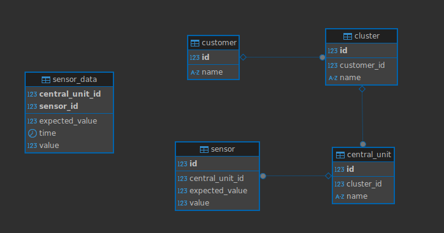

Fetch real time data from mocked temperature sensors.
### Tech stack:
- Java 21
- Spring Boot 3
- Reactive Mono/Flux
- Docker with PostgreSQL

### Try it out:
Ports in use: 5434:5432, 8080

Either:
- Start the app with IntelliJ and Java 21

Or:
- `$ docker compose up --build`
- Start the spring boot app

Test the app:

- Test an endpoint `$ curl -v http://localhost:8080/temperature/stream/sensor/1`
- All endpoints: http://localhost:8080/swagger-ui/index.html#

